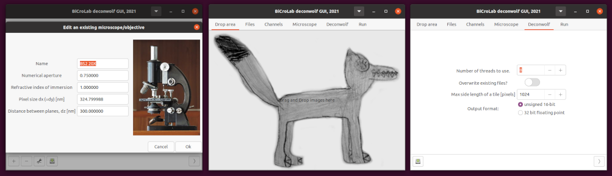

# Deconwolf GUI v0.0.6

This repo contains an optional GUI for
[deconwolf](https://github.com/elgw/deconwolf), or rather a command
line builder.

## Usage

Here is the intended workflow:

1. Drag and drop some `tif` files on the wolf in the first tab.

2. Head over to the **Files** tab to check that the channel names were
   identified automatically. By default the program expects that files follow
   the convention `channel_###.tif` for example `dapi_001.tif`
   would be identified as an image stained by `dapi`. If you use some other convention,
   you can configure that by setting a custom regular expression for channel identification under Config in the menu bar.

3. Go the the tab **Channels** and configure each channel, i.e. set
   the number of iterations per channel and specify the emission
   maxima. Hit the save button in the bottom.

4. Got to the **Microscope** tab and select microscope that was used,
   or create a new configuration using the basic optical parameters
   that is asked for. Don't forget to save.

5. Go to the **Deconwolf** tab to see if you want to use some other settings than the  
   default ones. 

6. Go to **Run** tab. Inspect the commands that will be started and hit
   the _"play"_ button to save this as a script or simply copy and paste into a terminal.

## Build and Install

There are pre-compiled binaries for Ubuntu and Windows under
[releases](https://github.com/elgw/deconwolf-gui/release). If your
platform is missing, please create a new
[issue](https://github.com/elgw/deconwolf-gui/issues). 

If you prefer to build by yourself or use some other platform, see [INSTALL.md](INSTALL.md).

## Notes

- Most likely there are bugs and they can only be fixed when they are known.
Please open a [new ticket](https://github.com/elgw/deconwolf/issues) if you
have any issues with the program.

- Some changes are planned for the future, see the [TODO.md](TODO.md)
  and also [open issues](https://github.com/elgw/deconwolf-gui/issues).

- This gui plays well with
[nd2tool](https://www.github.com/elgw/nd2tool) which converts `.nd2`
files (Nikon) to tif files. `nd2tool` is also capable of generating
shell scripts for deconvolution with deconwolf.
